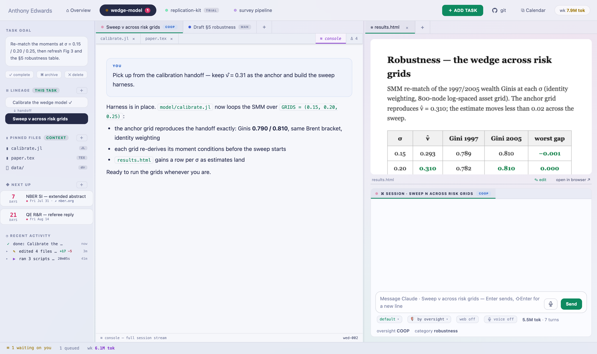
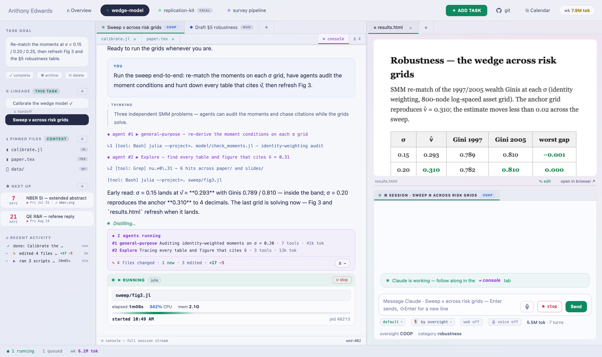

**Central Planner** is an open-source IDE I built (with Claude) to host my day-to-day research. Projects are partitioned into tasks (model formulation, computational solution, data cleaning) with the intensity of AI usage on each task chosen by the user (auto, plan, cooperative, manual).

The part I rely on most is how context moves between sessions. Every task carries pinned files and a lineage. When a task finishes, its session writes a structured handoff that records the summary, the artifacts, and the decisions taken. Downstream tasks inherit those handoffs, so a new session opens already knowing the project's living abstract, a primer for its category of work, the conclusions of its upstream tasks, and the exact files pinned to it. Claude picks up mid-project, weeks later and in a fresh conversation, with the state of play already in hand.

{.cp-shot}

Around each session sits the daily machinery. New HTML and PDF artifacts render inside the IDE for quick reading, a runner executes Julia, Python, R, and SQL files with output streaming into a tab, and a built-in LaTeX editor recompiles the draft on every save, with completions for citations and labels and jumps between source and PDF in both directions.

Sessions can also fan out into teams of agents, and the console narrates what each one is working on as it goes. Everything stays reversible. Each turn that edits files records a change log with full inline diffs and one-click rewind, and a git panel keeps every project's repository status in view, with pull and commit-and-push a click away.

{.cp-shot}

None of it is chained to one machine. I host the server on a desktop and reach it from my laptop and phone over a private [Tailscale](https://tailscale.com) network, and the same server ships a phone view for checking sessions, adding tasks, and reading artifacts from wherever I am. The repo includes a guide that walks through the whole setup.

The code lives on [GitHub](https://github.com/grahamelewis/central-planner), and a visual tour is [here](https://grahamelewis.github.io/central-planner/). If you give it a try, I would greatly appreciate feedback, whether on what breaks, what is missing, or what would make it more useful for your own work.

*Screenshots show a staged demo instance with fictional data. Central Planner is an independent project, unaffiliated with Anthropic.*
